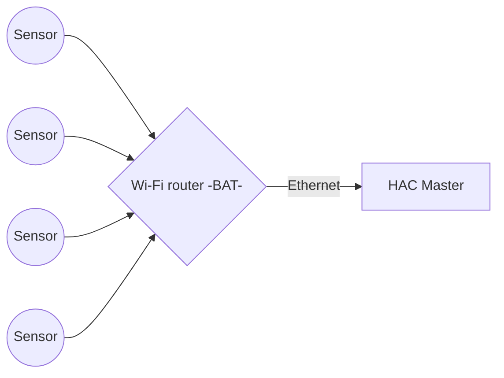
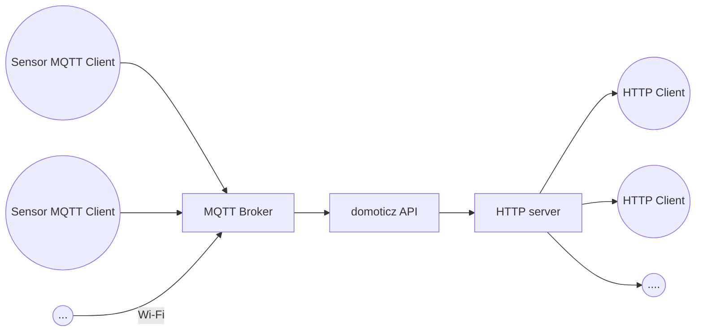

# esenz

ESP temperature and humidity sensor based on ESP8266

## Download
VirtualBox 5.2
[VirtualBox extensions for 5.2](https://download.virtualbox.org/virtualbox/5.2.26/Oracle_VM_VirtualBox_Extension_Pack-5.2.26.vbox-extpack)

## System schematic

## Software schematic

## Configuring from scratch

### Basic installation
	sudo apt install domoticz

Required libssl1.0.0, on debian and other distros where it isn't available, add the row below to */etc/apt/sources.list*:

	deb http://ftp.de.debian.org/debian jessie main

After that try to install the lib:

	apt-get install libssl1.0.0
And restart domoticz:

	stop domoticz
	sudo service domoticz.sh stop
	start domoticz
	sudo service domoticz.sh start

### Creating hardware/broker

Visit API page, create new Hardware of type:
- MQTT Broker on LAN
- IP port 1883 
- other default settings incl. "domoticz/out"

Create sensors with:
- new hardware sensor (dummy)
- add virtual sensors (for example, temperature/humidity, remember idx of said sensors.

### Activate broker -> device connection
Install mosquitto:

	sudo apt install mosquitto
	sudo apt install mosquitto-clients

Depending of infrastructure (VM or not), por forwar IP port 1883 for MQTT and, if required, the SSL MQTT port.

### Test with clients

Send a temperature of 22 and a humidity of 40 %RH, with a comfort level of 1:

	mosquitto_pub -h <a.b.c.d> -m '{ "idx" : 1, "nvalue" : 0, "svalue" : "22;40;1" }' -t 'domoticz/in'

