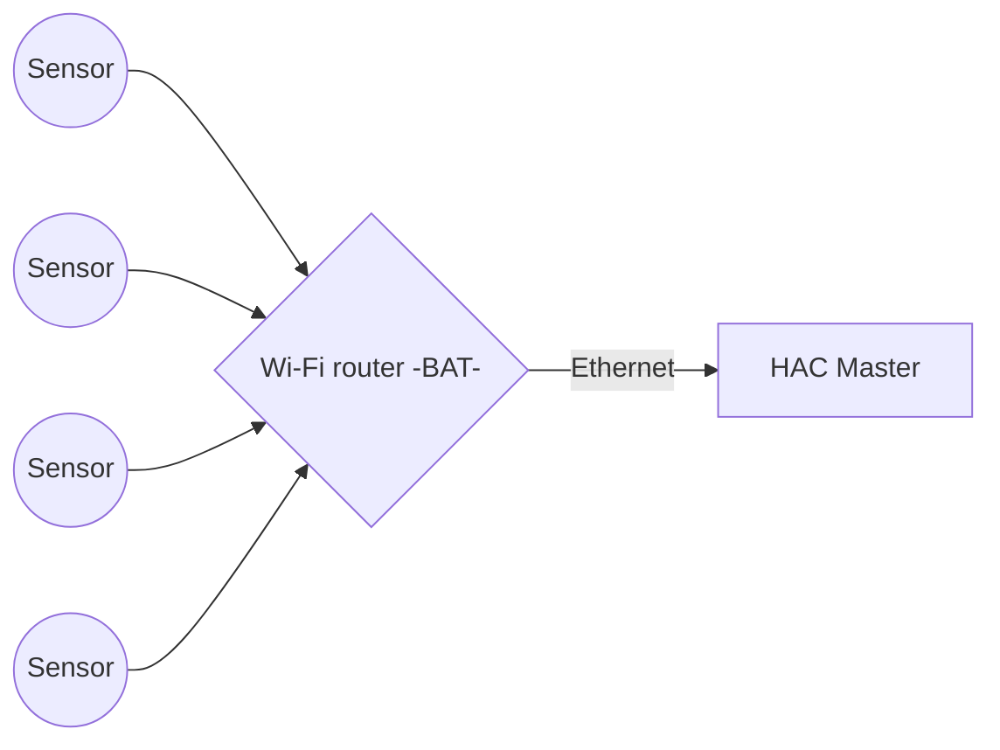
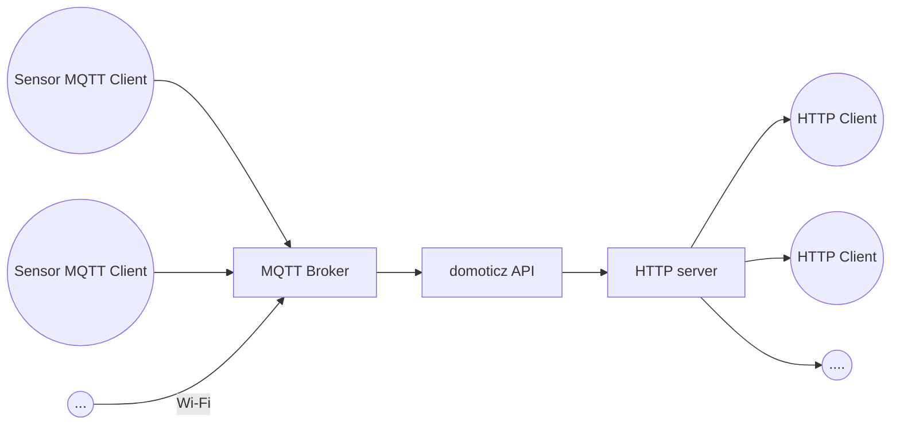

  GNU nano 2.7.4                                                                          File: README.md                                                                                    

# esenz

ESP temperature and humidity sensor based on ESP8266

## Download
VirtualBox 5.2
[VirtualBox extensions for 5.2](https://download.virtualbox.org/virtualbox/5.2.26/Oracle_VM_VirtualBox_Extension_Pack-5.2.26.vbox-extpack)

## System schematic

## Software schematic

# esenz

ESP temperature and humidity sensor based on ESP8266

# Files

StackEdit stores your files in your browser, which means all your files are automatically saved locally and are accessible **offline!**

# Download
VirtualBox 5.2
[VirtualBox extensions for 5.2](https://download.virtualbox.org/virtualbox/5.2.26/Oracle_VM_VirtualBox_Extension_Pack-5.2.26.vbox-extpack)

## System schematic

## Software schematic

